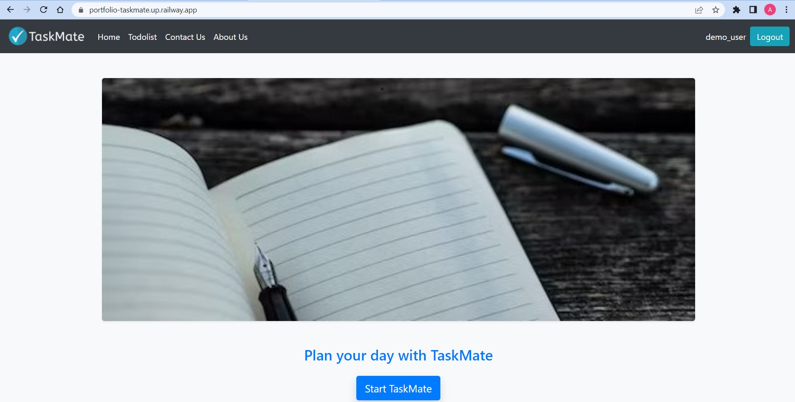
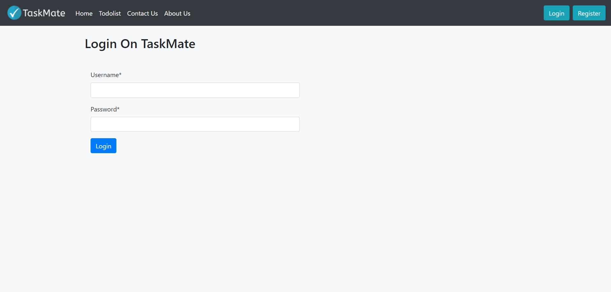
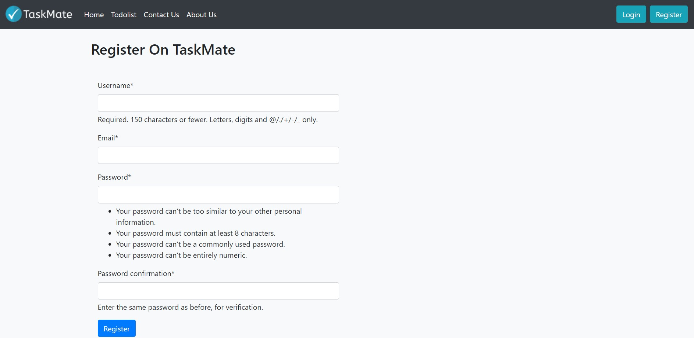
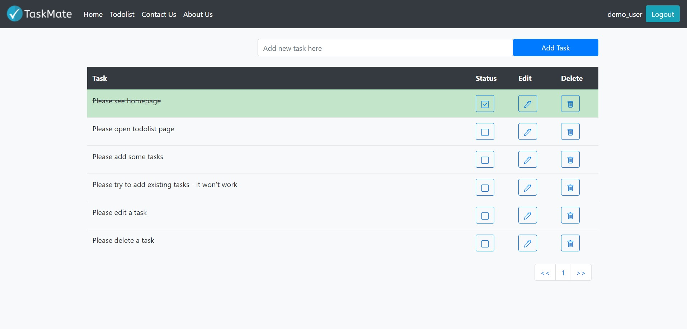

# PORTFOLIO-taskmate
# Taskmate

Taskmate is a task manager web application build using Django framework. The goal of this project is to make application with Django framework along with it's common features like MVT architecture, working with forms, default authentication, .env files and the deployment process on Railway platform with PostgreSQL database. The inteface is adapted to mobile use and considers accessibility usage.

## Screenshots

## Demo

Deployed on Railway - https://portfolio-taskmate.up.railway.app/

Username: demo_user  
Password: use_django!

Note: unfortunately, Railway deployment is available only 21 days a month. If you want to see the site and it in't available, please contact me by email artem.ramus@gmail.com.
  
## Documentation

[Official Django Documentation](https://www.djangoproject.com/)
